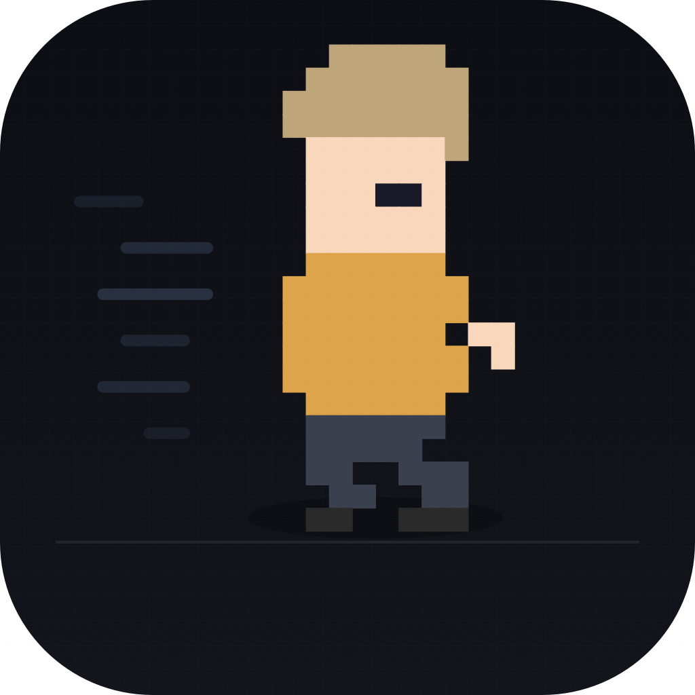

<p align="center">
  
</p>

<h1 align="center">Doffice</h1>

<p align="center">
  <strong>Claude Code 세션을 시각적으로 관리하는 Windows 데스크톱 앱</strong><br>
  <sub>`dev` 브랜치는 Windows 개발 기준, `main` 브랜치는 macOS 원본 기준으로 유지합니다.</sub>
</p>

<p align="center">
  
  
  
  
</p>

---

## 주요 기능

### 멀티 세션 관리

- 동시에 여러 Claude Code 세션을 운영하고 실시간 모니터링
- Grid / Single / Office / Strip **4가지 뷰 모드**
- Shift+클릭으로 세션 다중 선택 & 비교
- 세션 카드 우클릭 → Finder, 경로 복사, 터미널 열기

### 픽셀 아트 오피스

- 각 세션이 픽셀 캐릭터로 표현되는 가상 오피스
- 개발자, QA, 기획자, 디자이너, 리뷰어, SRE 등 **직업 시스템**
- 작업 상태에 따라 캐릭터가 자동으로 움직이고 행동
- 81종 캐릭터 수집, 300개 도전과제 & 레벨 시스템

### Git 클라이언트

- GitKraken 스타일 3패널 레이아웃 (사이드바 + 커밋 그래프 + 상세)
- 커밋 그래프 시각화 (레인, 머지 곡선, 태그 노드)
- stage / unstage / commit / branch / tag / stash
- Diff 뷰어 (추가/삭제 하이라이팅, Hunk 구분)

### 커스텀 테마 엔진

- **Hex 코드**로 강조 색상 자유 설정
- **그라데이션** 배경 지원 (시작/끝 색상)
- 시스템 폰트 목록에서 **커스텀 폰트** 선택 + 크기 조절
- JSON 파일로 테마 **내보내기/불러오기**
- 배경 밝기 기반 **자동 텍스트 대비** 처리

### 커스텀 단축키

- 모든 주요 기능에 대한 **사용자 정의 단축키** 매핑
- 키 레코더 UI — 원하는 키 조합을 직접 눌러서 캡처
- **충돌 감지** — 다른 기능 및 macOS 시스템 단축키와의 중복 경고
- 개별/전체 기본값 복원 및 할당 해제(Unassigned) 지원

### 실시간 추적 & 보안

- 토큰 사용량 (일간/주간) 실시간 모니터링 & 비용 한도
- 메뉴바 위젯으로 빠른 상태 확인
- 다국어 지원 (한국어 / English / 日本語)

---

## 브랜치 운영

- `dev`
  Windows 버전 개발 브랜치입니다. 저장소 루트가 곧 실제 앱 루트입니다.
- `main`
  macOS 원본 기준 브랜치입니다. SwiftUI/Xcode 구현을 참고할 때만 전환해서 확인합니다.

즉 `dev`에서는 이 저장소 루트에서 바로 개발하고, mac 원본을 참고할 때만 `main`으로 전환합니다.

---

## 개발 설치

모든 명령은 저장소 루트에서 실행합니다.

```bash
git switch dev
npm install
```

실행:

```bash
npm start
```

검증:

```bash
npm run typecheck
```

빌드:

```bash
npm run build
```

설치형 exe 패키징:

```bash
npm run dist:win
```

`npm run dist:win` 과 `npm run pack:win` 은 Windows PowerShell에서 실행하는 것을 기준으로 합니다.

포터블 exe 패키징:

```bash
npm run pack:win
```

### 수동 설치

[최신 릴리스](https://github.com/leesh0829/Doffice/releases/latest)에서 `Doffice Setup 0.1.0.exe` 다운로드 → 설치 프로그램 실행 → 안내에 따라 설치

### 소스에서 빌드

```bash
git clone -b dev --single-branch https://github.com/leesh0829/Doffice.git
cd Doffice
npm install
npm run build
```

설치형 exe 생성:

```bash
npm run dist:win
```

포터블 exe 생성:

```bash
npm run pack:win
```

---

## 요구사항

| 항목            | 최소 사양                                  |
| --------------- | ------------------------------------------ |
| **macOS**       | 14.0 (Sonoma)                              |
| **Windows**     | 10 +                                       |
| **Claude Code** | `npm install -g @anthropic-ai/claude-code` |
| **Codex**       | `npm install -g @openai/codex`             |

---

## 키보드 단축키

> 모든 단축키는 **설정 → 단축키** 탭에서 자유롭게 변경할 수 있습니다.

| 단축키 | 동작               |
| ------ | ------------------ |
| `⌘T`   | 새 세션            |
| `⌘W`   | 세션 닫기          |
| `⌘1~9` | 세션 전환          |
| `⌘R`   | 세션 재시작        |
| `⌘P`   | 커맨드 팔레트      |
| `⌘J`   | 액션 센터          |
| `⌘\`   | 분할 뷰 전환       |
| `⌘⇧O`  | 오피스 뷰 전환     |
| `⌘⇧T`  | 터미널 뷰 전환     |
| `⌘⇧E`  | 세션 로그 내보내기 |
| `⌘K`   | 터미널 지우기      |
| `⌘.`   | 작업 취소          |

---

## 산출물 위치

- 프론트 빌드: `dist/`
- Electron 메인 빌드: `dist-electron/`
- unpacked 실행본: `release/win-unpacked/Doffice.exe`
- 설치형 패키지: `release/Doffice Setup <version>.exe`

---

## 기술 스택

- Electron
- React 18
- Vite
- TypeScript
- Claude Code CLI 연동

---

## 라이선스

MIT
